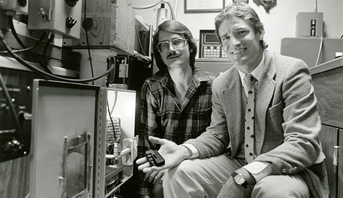

## Les progrès de l’impression 3D de 1986 à 1990

La période allant de 1986 à 1990 marque une avancée décisive dans le développement de l’impression 3D, avec l’apparition des premières technologies commercialisées et l’émergence d’entreprises dans ce domaine.

En 1986, Chuck Hull, déjà reconnu pour son invention du procédé de SLA, fonde la société 3D Systems. Cette entreprise joua un rôle clé en lançant en 1987 la première imprimante 3D commerciale, la SLA-1 (à environ 300 000 $ à ce moment). Cette machine représentait une véritable révolution technologique. Grâce à l’utilisation d’une résine photosensible durcie par un laser UV, la SLA-1 offrait une précision et une complexité géométrique jusqu’alors inédites.

Parallèlement, en 1988, une nouvelle technologie baptisée SLS fut développée par Carl Deckard, un étudiant à l’Université du Texas. Cette méthode innovante utilisait un laser puissant pour fusionner de la poudre polymère couche par couche, permettant de produire des pièces solides et résistantes sans support structurel supplémentaire. Le procédé SLS a rapidement trouvé des applications industrielles dans la production de prototypes fonctionnels et de pièces techniques complexes.

  

La même année, la société Stratasys, fondée par Scott Crump, introduisit la technologie FDM. Cette méthode, plus accessible et plus abordable, repose sur le dépôt de filament plastique fondu couche par couche. Le procédé FDM est aujourd’hui l’une des technologies les plus répandues dans les imprimantes 3D domestiques et professionnelles.

  

Ces années ont marqué le passage de l’impression 3D d’une technologie expérimentale à une solution industrielle prometteuse. Grâce à ces avancées, les bases techniques utilisées dans les imprimantes 3D modernes ont été définies, ouvrant la voie à une large adoption dans les secteurs du prototypage rapide, de l’aéronautique, de la médecine et de l’ingénierie.

Cette période fut donc déterminante dans l’histoire de l’impression 3D, posant les fondations d’une innovation technologique qui continue d’évoluer encore aujourd’hui.
