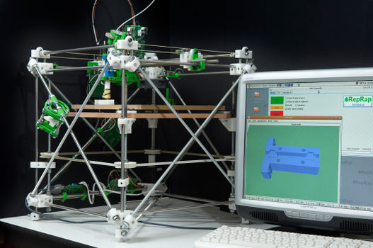

## Avènement du projet RepRap : Un tournant majeur dans les années 2000

Les années 2000 marquent un véritable tournant dans l’histoire de l’impression 3D avec la naissance du projet RepRap (Replicating Rapid Prototyper), un projet fondamental qui a grandement contribué à la démocratisation de cette technologie.

En 2004, Adrian Bowyer, un professeur d’ingénierie mécanique à l'Université de Bath au Royaume-Uni, lança le projet RepRap. L’objectif ambitieux de ce projet était de développer une imprimante 3D autoreproductible capable d’imprimer la majorité de ses propres composants. Cette approche visait à rendre l’impression 3D plus accessible au grand public, en proposant une machine abordable et facilement reproductible.

Le projet RepRap s’inscrit dans la philosophie de l’open-source, ce qui signifie que toutes les conceptions, schémas et logiciels associés étaient librement accessibles, permettant ainsi à quiconque de fabriquer et d’améliorer la machine. Cette approche collaborative a joué un rôle clé dans la popularisation de l’impression 3D personnelle.

Le développement de ce projet a également été grandement facilité par l’expiration de plusieurs brevets clés sur les technologies d’impression 3D, notamment ceux liés à la technique du FDM. Ces brevets, initialement déposés par Stratasys, étaient arrivés à échéance au début des années 2000, permettant ainsi à de nombreux acteurs indépendants et passionnés d’explorer et d’adapter cette technologie sans contraintes juridiques. L’ouverture de ces technologies a permis à des initiatives comme le projet RepRap de se développer librement, favorisant l’innovation et la multiplication des modèles d’imprimantes accessibles.

Le premier modèle fonctionnel issu de ce projet, appelé Darwin, vit le jour en 2007. La Darwin fut la première imprimante 3D capable de produire certaines de ses propres pièces structurelles, incarnant parfaitement le concept d’autoréplication. Bien que rudimentaire en comparaison aux modèles actuels, cette machine posait les bases des imprimantes 3D modernes et ouvrait la voie à une nouvelle ère d’innovation.

Le succès du projet RepRap a rapidement inspiré de nombreux passionnés et développeurs à travers le monde, donnant naissance à une large communauté de makers. Ce mouvement a favorisé l’émergence de modèles améliorés tels que la Mendel, la Prusa ou encore la Huxley, rendant les imprimantes 3D de plus en plus accessibles et performantes.

L’avènement du projet RepRap a marqué une étape clé dans l’évolution de l’impression 3D en permettant son adoption à grande échelle, aussi bien pour des usages professionnels que personnels. Grâce à cette initiative, l’impression 3D est sortie du cadre industriel pour devenir une technologie à la portée de tous, ouvrant la voie à une créativité et une innovation sans précédent.
