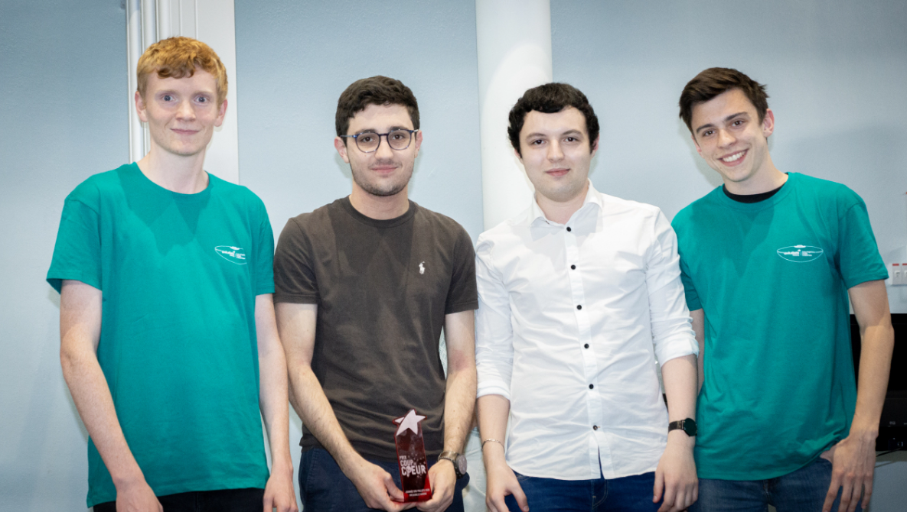

# Présentation de l'équipe

Notre équipe est composée de quatre étudiants passionnés et ingénieux. Chacun a joué un rôle clé dans la reconstruction de l’imprimante Darwin en respectant l’esprit du projet RepRap.

  

---

## Verhaeghe Robin  
**Responsable modélisation & impression 3D**  
- Réalise les modèles 3D sous FreeCad.  
- S’occupe de l'impression des pièces nécessaires à l'assemblage.  
- Ajuste les fichiers STL originaux selon les composants disponibles.

---

## Dumont Mattéo  
**Responsable documentation & fidélité historique**  
- Tient à jour le site web et la documentation du projet.  
- Veille à respecter le modèle original de la Darwin.  
- Prépare les supports pour la soutenance et la communication du projet.

---

## Miramont Cyrille  
**Responsable commandes & modélisation structurelle**  
- Gère l’achat et la réception des composants.  
- Participe à la modélisation et à l'assemblage mécanique de l’imprimante.  
- Contribue aux ajustements structurels selon les besoins.

---

## Verhaeghe Aurélien  
**Responsable recherches historiques & STL**  
- Fouille les archives RepRap pour retrouver les bons plans.  
- Trie, vérifie et adapte les pièces trouvées pour le projet.  
- Intervient également sur la modélisation de certaines pièces oubliées.

## 🏆 Prix Coup de cœur du jury

L’équipe a été récompensée par le Prix Coup de cœur pour la qualité de son travail, la documentation rigoureuse et la fidélité au projet original Darwin.

