# Impression des pièces 3D

Cette section décrit les pièces qu'il faut imprimer et la quantité nécessaire.

## Liste des pièces

### Sans axe

| Nom                    | À quoi ça sert                                                    | Quantité | Fichier STL | Image |
|------------------------|--------------------------------------------------------------------|:--------:|-------------|-------|
| Corner brackets        | Brackets d’assemblage des coins de la structure                    |    8     |[corner-bracket.stl](../piece_3d/Corner-bracket.stl)             |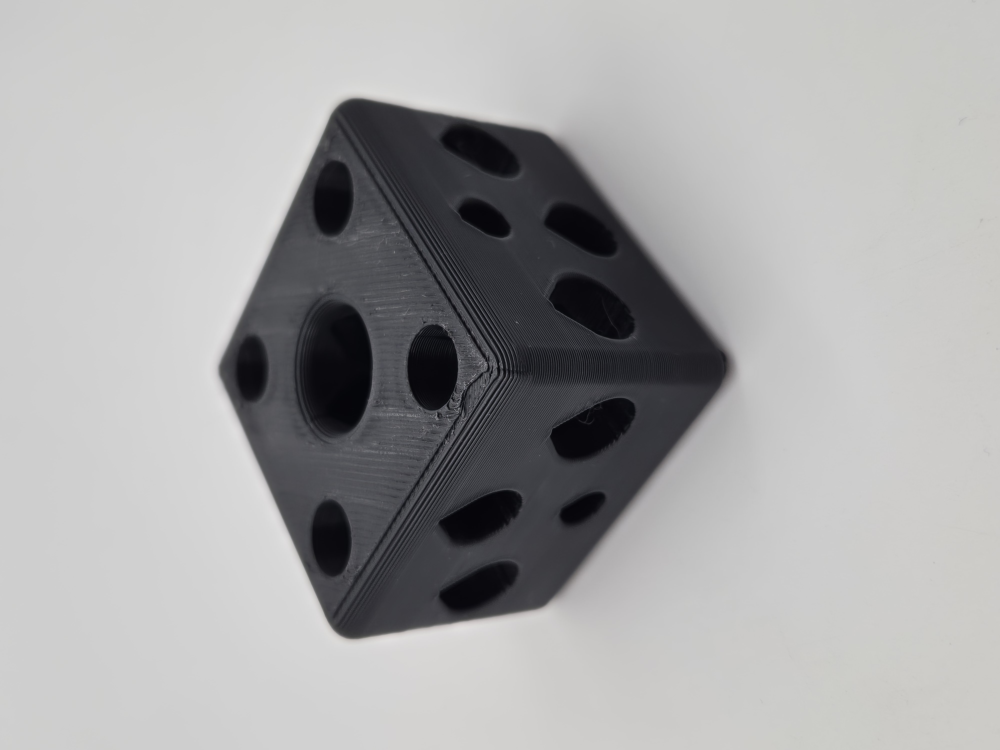|
| Diagonal tie bracket   | Support triangulaire pour rigidifier la structure                  |   20     |[diagonal-tie-bracket.stl](../piece_3d/Diagonal-tie-bracket.stl)             |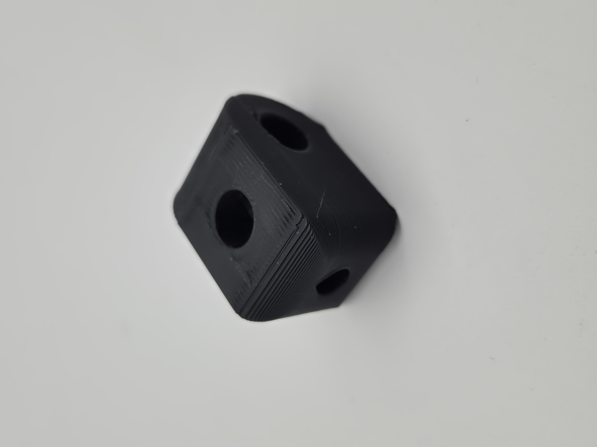|
| Bed constraint bracket | Maintien du plateau (empêche le déplacement latéral du bed)        |    4     |[bed-constraint-bracket.stl](../piece_3d/Bed-constraint-bracket.stl)             |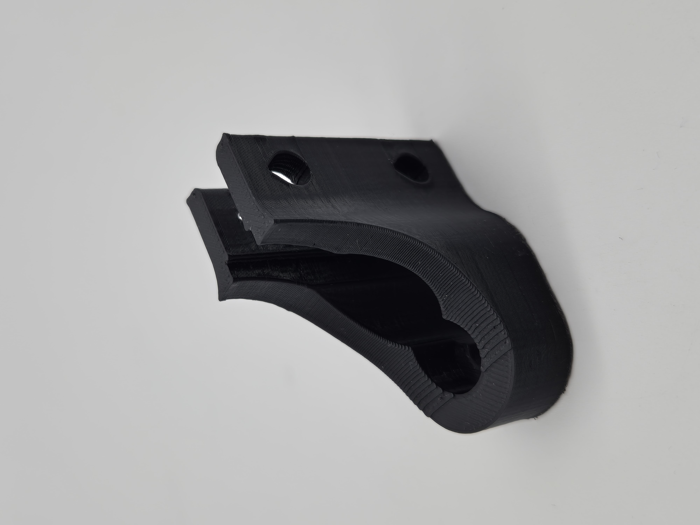|
| Bed corner             | Support d’angle pour le plateau d’impression                       |    4     |[bed-corner.stl](../piece_3d/Bed-corner.stl)              ||
| Bed clamp              | Pince pour maintenir le plateau sur la structure                   |    4     |[bed-clamp.stl](../piece_3d/Bed-clamp.stl)             |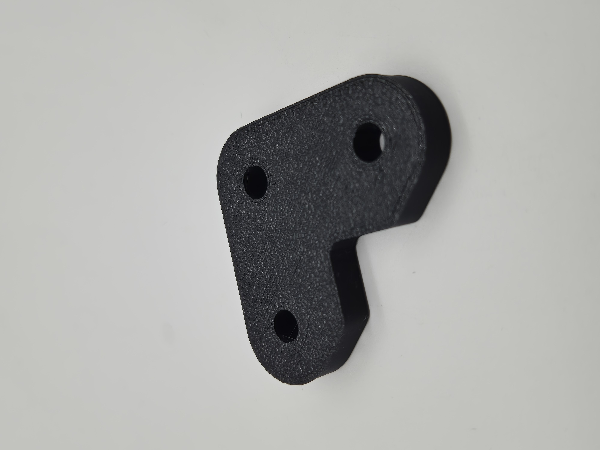|

---

### Axe X

| Nom                  | À quoi ça sert                                                           | Quantité | Fichier STL | Image |
|----------------------|---------------------------------------------------------------------------|:--------:|-------------|-------|
| X constraint bracket | Maintien latéral pour empêcher le chariot X de dévier                     |    1     |[x-constraint-bracket.stl](../piece_3d/X-constraint-bracket.stl)             |       |
| X carriage           | Chariot portant la tête d’extrusion, coulisse                             |    1     |[x-carriage.stl](../piece_3d/X-carriage.stl)             |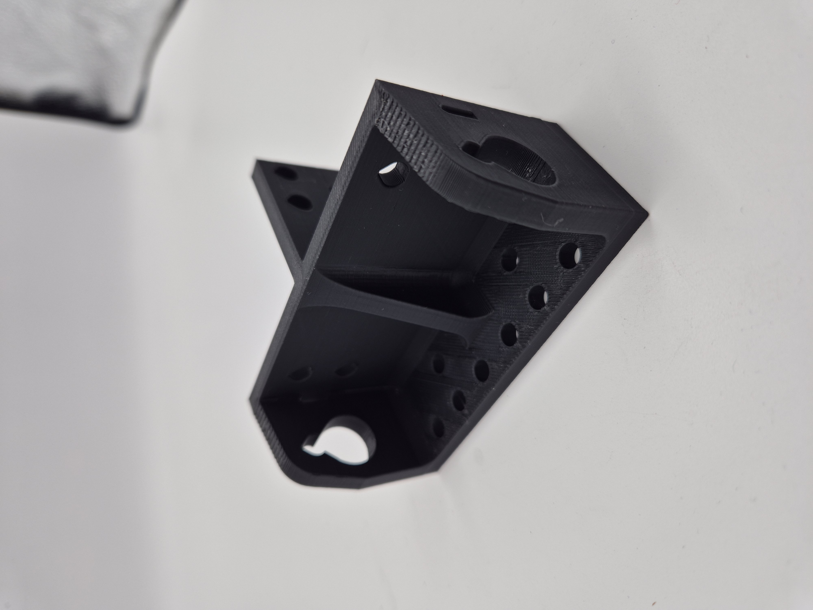|
| X idler bracket      | Support tendeur / poulie libre pour la courroie                           |    1     |[x-idler-bracket.stl](../piece_3d/X-idler-bracket.stl)             |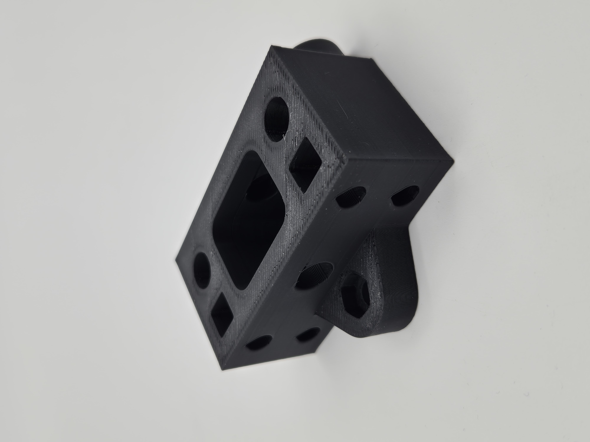|
| X motor bracket      | Support moteur NEMA 23                                                    |    1     |[x-motor-bracket.stl](../piece_3d/X-motor-bracket.stl)             |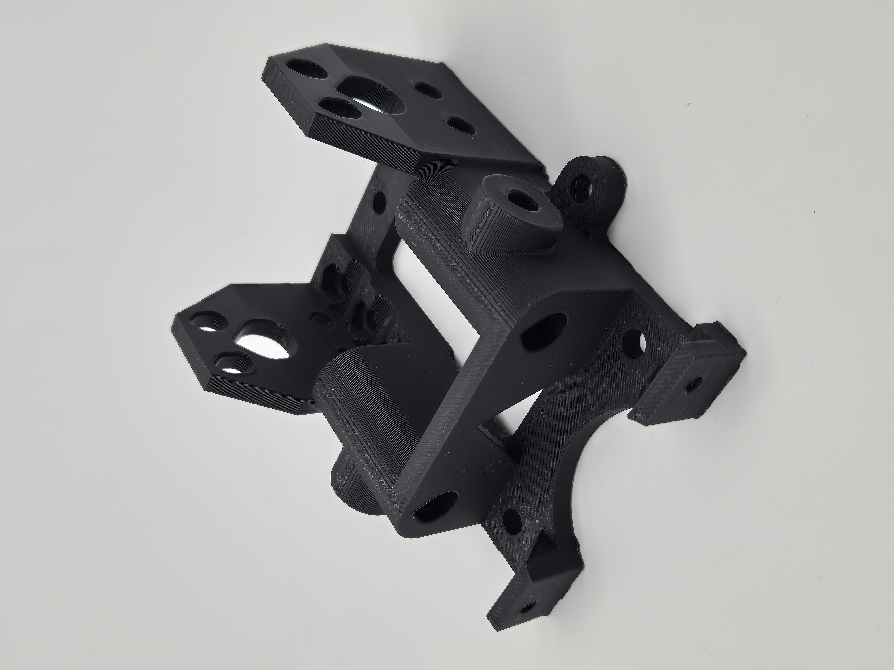|
| X belt clamp         | Pince pour fixer la courroie                                              |    6     |[x-belt-clamp.stl](../piece_3d/X-belt-clamp.stl)             |       |

---

### Axe Y

| Nom                 | À quoi ça sert                                                         | Quantité | Fichier STL | Image |
|---------------------|-------------------------------------------------------------------------|:--------:|-------------|-------|
| Y bearing housing   | Support pour le palier                                                  |    3     |[y-bearing-housing.stl](../piece_3d/Y-bearing-housing.stl)             |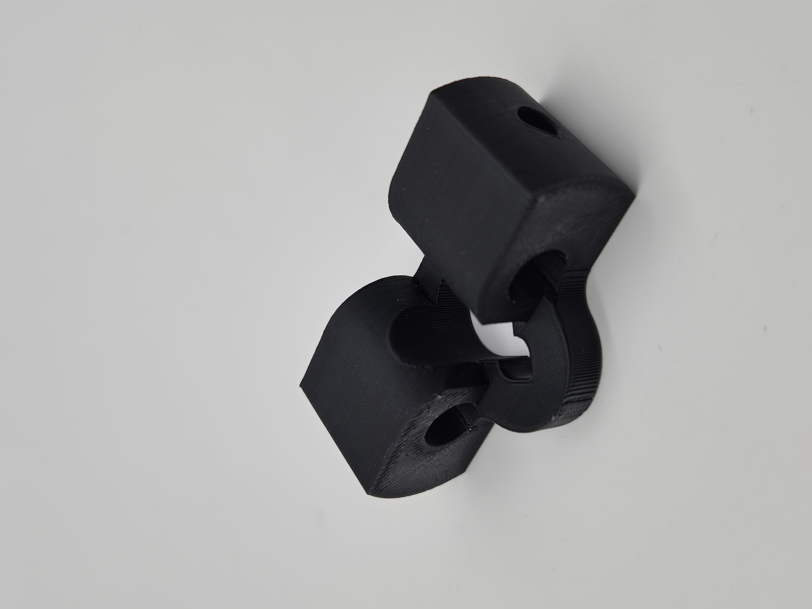|
| Y belt clamp        | Pince pour fixer la courroie                                            |    6     |[y-belt-clamp.stl](../piece_3d/Y-belt-clamp.stl)             |       |
| Y motor bracket     | Support moteur NEMA 23                                                  |    1     |[y-motor-bracket.stl](../piece_3d/Y-motor-bracket.stl)             |       |
| Y motor coupling    | Accouple le moteur NEMA 23 à la tige filetée                            |    1     |[y-motor-coupling.stl](../piece_3d/Y-motor-coupling.stl)             |       |

---

### Axe Z

| Nom                  | À quoi ça sert                                                              | Quantité | Fichier STL | Image |
|----------------------|------------------------------------------------------------------------------|:--------:|-------------|-------|
| Z studding tie       | Collier de liaison de tige filetée pour guider l’écrou                       |    3     |[z-studding-tie.stl](../piece_3d/Z-studding-tie.stl)             |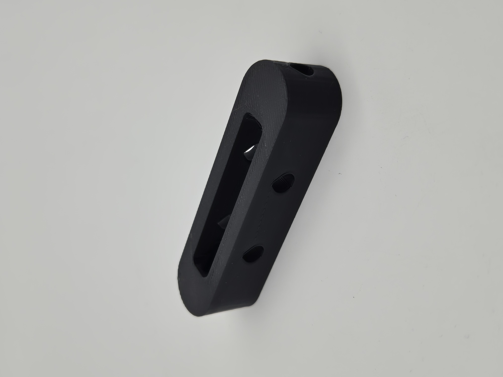|
| Z motor bracket      | Support moteur NEMA 23                                                       |    1     |[z-motor-bracket.stl](../piece_3d/Z-motor-bracket.stl)             |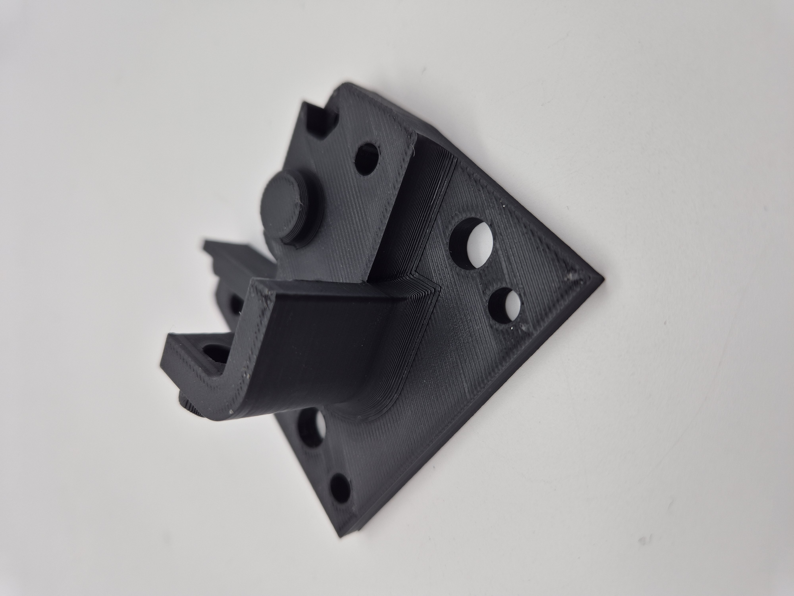|
| Z motor coupling     | Accouple le moteur NEMA 23 à la tige filetée                                 |    1     |[z-motor-coupling.stl](../piece_3d/Z-motor-coupling.stl)             |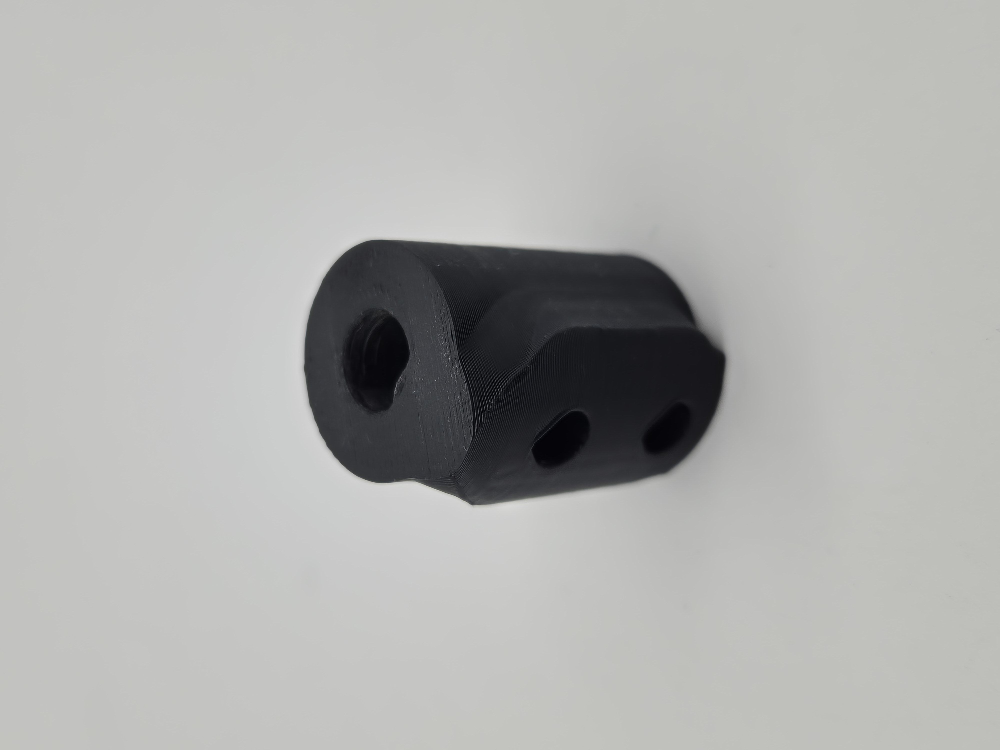|
| Z tensioner          | Tend, positionne et bloque la courroie                                       |    1     |[z-tensioner.stl](../piece_3d/Z-tensioner.stl)             |       |
| Z tensioner clamp    | Pince pour bloquer la tension de courroie                                    |    1     |[z-tensioner-clamp.stl](../piece_3d/Z-tensioner-clamp.stl)             |       |
| Z tensioner idler    | Poulie libre pour guider la courroie                                         |    1     |[z-tensioner-idler.stl](../piece_3d/Z-tensioner-idler.stl)             |       |

Voici le dossier des pièces complet au besoin : [Dossier complet](../piece_3d/Reprap-cartesian-bot-1.0.5.zip)

