# Cadre de base

## Assemblage de la structure de base

L’image ci-dessous montre l’assemblage de la base carrée de l’imprimante Darwin :

  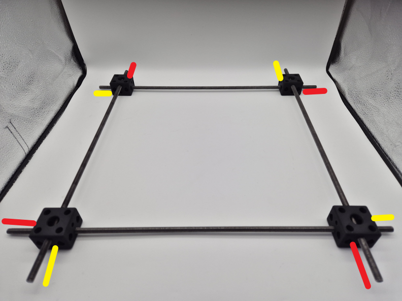

Cette base est constituée de :

- **4 corner brackets**
- **4 tiges filetées M8 de 500 mm**,
- **8 écrous M8**

### Détail des longueurs de dépassement

Pour garantir un assemblage stable et aligné :

- 🔴 **Traits rouges** : la tige dépasse de **2,8 cm** à l’extérieur du corner bracket.
- 🟡 **Traits jaunes** : la tige dépasse de **2,0 cm**.

Ces longueurs assurent :
- La compatibilité avec les autres composants (moteurs, supports…),
- Une géométrie correcte,
- La solidité du cadre.

### Précisions de montage

- Les tiges filetées mesurent 500 mm chacune.
- Les tiges sont simplement insérées et maintenues par des écrous qui viennent s'insérer à l'intérieur des corner brackets

### ✅ Conseil de vérification

Pour valider les dimensions du cadre :
- Mesurez les deux diagonales.
- Si elles sont égales, le carré est bien formé.
- Sinon, ajustez légèrement la position des coins jusqu’à l’équilibre.

--- 

## Installation des tiges de renfort diagonales et des axes Z

  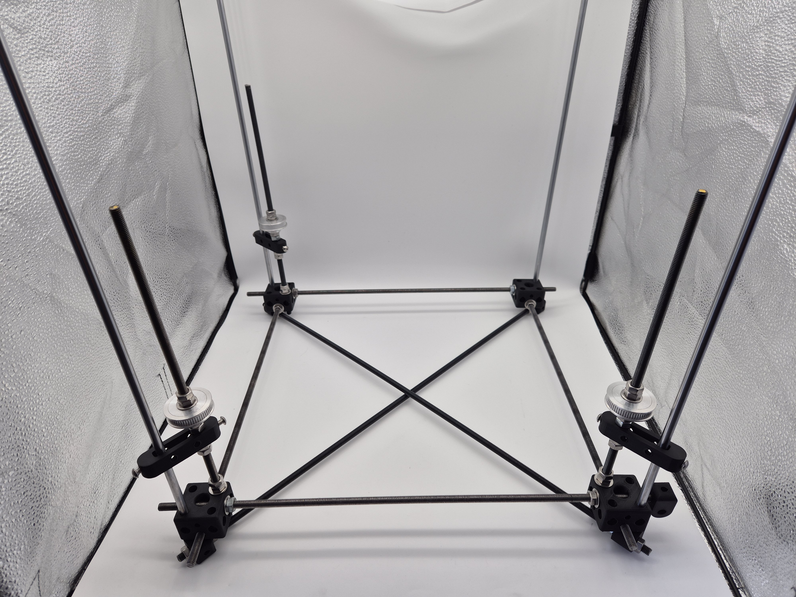

Pour rigidifier la structure, nous avons installé des tiges filetées en diagonale entre les coins du cadre. Cela forme deux diagonales qui se croisent au centre du carré de base.

> **Note :** Sur la photo ci-dessus, on observe des écrous et rondelles à l'extérieur des coins. Nous les avons retirés par la suite afin d'alléger la structure et faciliter l’alignement.

## Installation des tiges de l’axe Z

  

Sur trois des coins du cadre, des tiges lisses verticales sont montées à l’aide de colliers de serrage fixés directement sur les coins imprimés. Ces tiges servent de guides pour le plateau mobile de l’axe Z.

**Important** : La quatrième tige n’est pas montée car ce coin accueille le moteur de l’axe Z. Il sera fixé plus tard avec un support.

---

## Montage du moteur de l’axe Z

  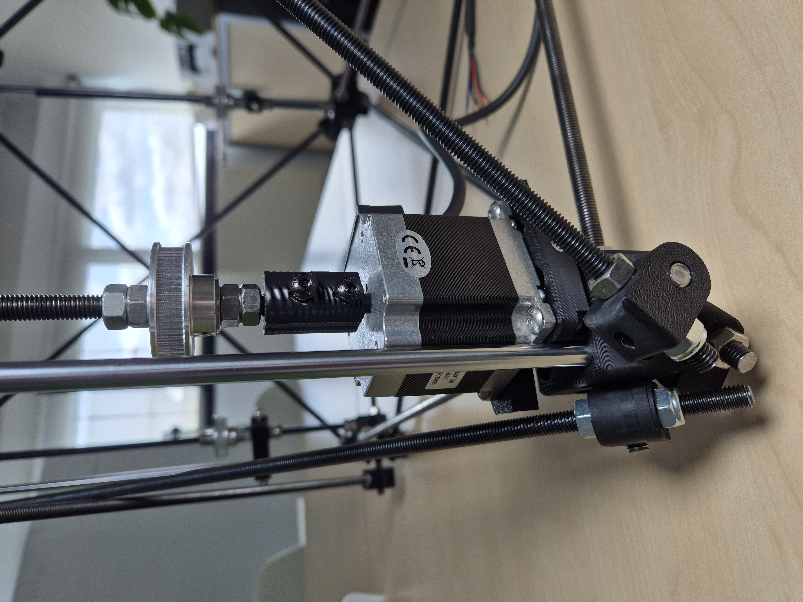

Sur le quatrième coin du cadre, à l’emplacement laissé libre de tige lisse, on installe le moteur NEMA 23 dédié à l’axe Z. Celui-ci est fixé à l’aide d’un support imprimé en 3D.

Le montage se compose des éléments suivants :
- Un moteur NEMA 23 fixé sur un support imprimé
- Une tige filetée verticale directement couplée à l’axe du moteur à l’aide d’un motor coupling
- Une poulie GT2 montée sur la tige filetée

### Étapes :
1. Fixer le support moteur sur le coin du cadre avec vis + écrous
2. Enfiler la tige filetée dans l’accouplement et la bloquer avec une clé Allen.
3. Installer la poulie GT2 en la maintenant avec ses vis latérales.
4. Vérifier que la tige tourne librement sans friction excessive.

---

## Montage du Bed Corner et du Bed Constraint Bracket

  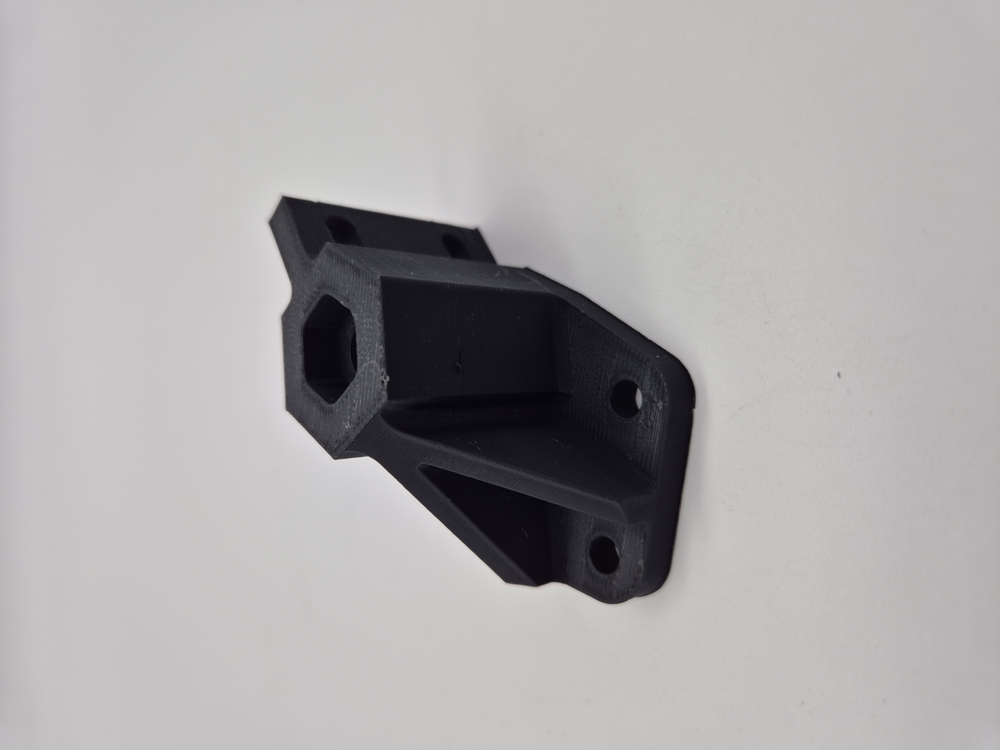

### Pièces nécessaires :
- **4× Bed Corner**
- **4× Bed Constraint Bracket** 
- **8× Vis + écrous M4**
- **4× Ressort métallique**

---

### Étapes de montage :

1. **Préparation du Bed Corner** :
   - Insérez un **écrou M8** dans le logement hexagonal supérieur du Bed Corner.
   - Placez **un ressort** à l’intérieur du trou vertical destiné à la tige filetée.  
     Ce ressort permet de garder l’écrou en pression constante, ce qui est essentiel pour le futur mouvement vertical du plateau Z.  

2. **Fixation de la tige lisse verticale** :
   - Glissez une tige lisse Ø8 mm dans le passage prévu sur le Bed Corner.
   - Positionnez la Bed Constraint Bracket de manière à pincer la tige.
   - Vissez-la avec deux vis M4 et leurs écrous.  
     Cela maintient fermement la tige, tout en conservant la possibilité de mouvement si nécessaire.

3. **Conseils de montage** :
   Pour placer cette pièce sur l'imprimante, nous vous conseillons de retirer une des tiges.
   Vous devriez avoir ce résultat :

  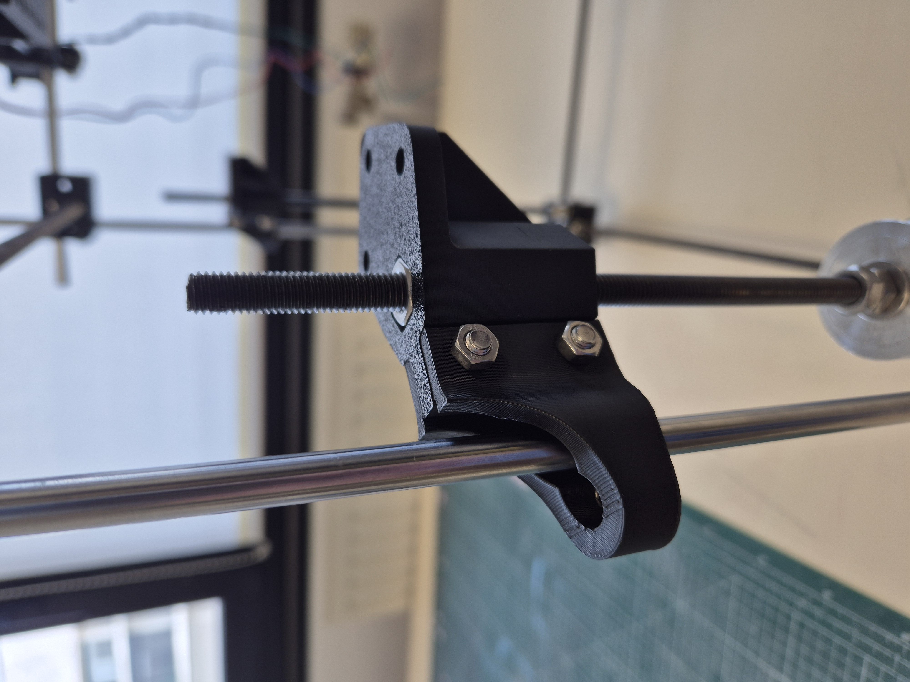

---

## Montage du cadre supérieur

  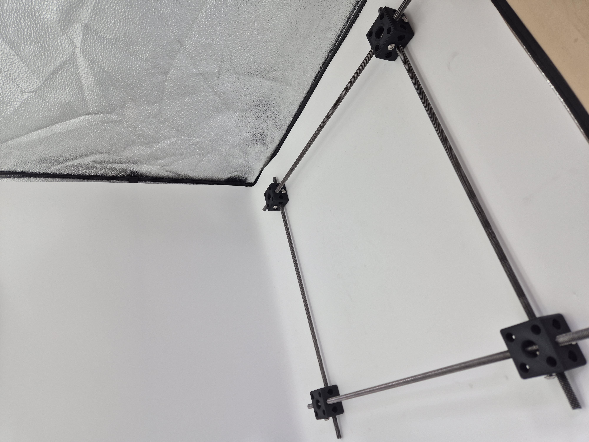

Le cadre supérieur de l’imprimante est identique à celui du bas et suit exactement le même procédé de montage :

- Utilisez 4 corner brackets
- Assemblez-les à l’aide de tiges filetées M8 de 500 mm comme pour la base.

⚠️ **Différence importante** :  
Deux des tiges, positionnées face à face, sont ici des **tiges lisses de 8 mm** au lieu de filetées (elles correspondent aux tiges qui rentrent dans les trous supérieurs).  
Elles servent de **guides verticaux pour le plateau Z**.  
Veillez à bien les aligner avec les tiges lisses inférieures pour assurer un glissement fluide du lit.

---

## Montage du chariot X et du moteur sur le cadre supérieur

Après avoir assemblé le cadre supérieur, on installe les pièces suivantes :

### Pièces à monter :

- X_carriage 
- X_motor-bracket
- X-idler-bracket

Ces trois pièces s’enfilent sur les deux tiges lisses du cadre supérieur.

### 🛠 Étapes de montage

1. Insérer les tiges lisses dans les coins du cadre supérieur
2. Faire glisser le X-idler-bracket sur l'une des extrémités
3. Faire glisser le X_carriage (au centre) avec le petit axe vertical dirigé vers le haut. Cette pièce accueillera ensuite l'extrudeur
4. Faire glisser le X-motor-bracket à l'autre extrémité de la tige
5. Fixer un moteur NEMA 23 sur le X-motor-bracket à l'aide de 4 vis
6. Insérer une poulie GT2 sur l’axe moteur et une autre dans le X-idler-bracket

### 📸 Vue d’ensemble

  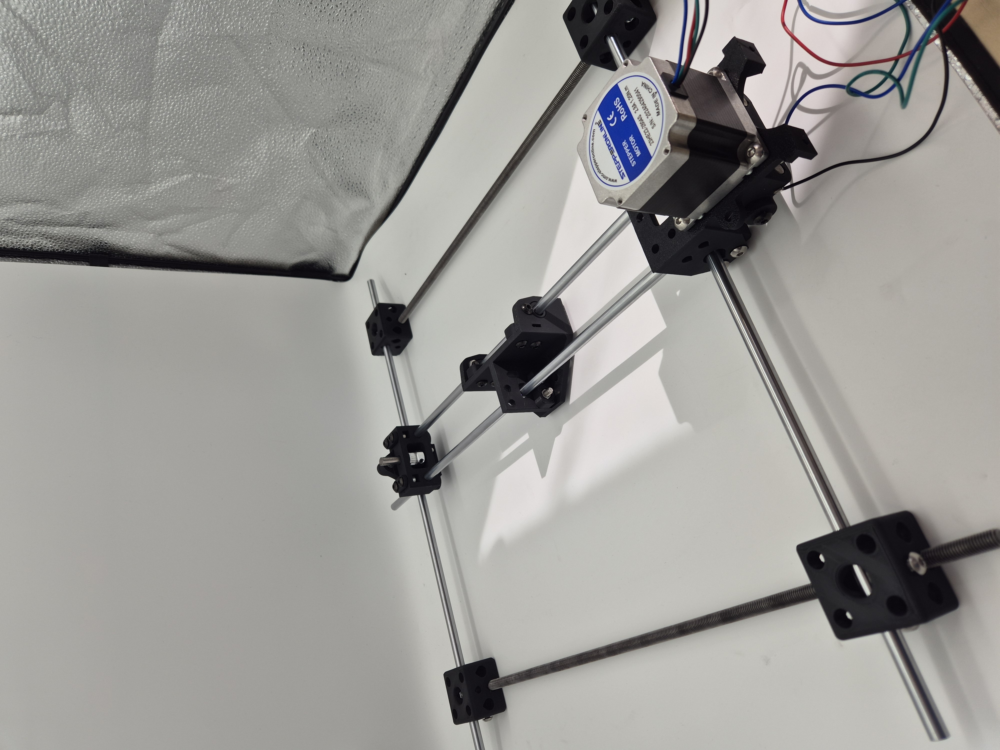

  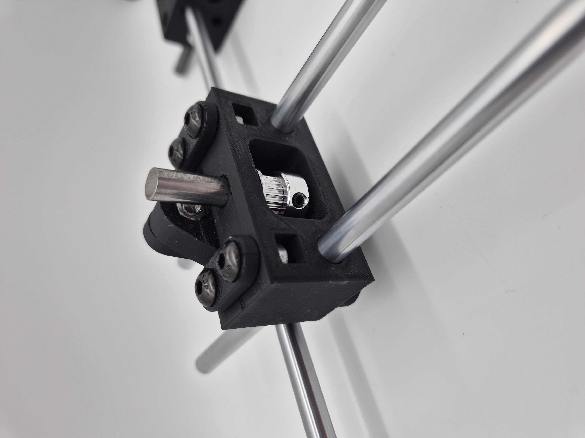

  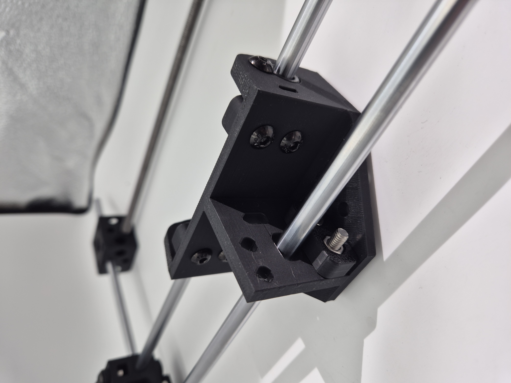

  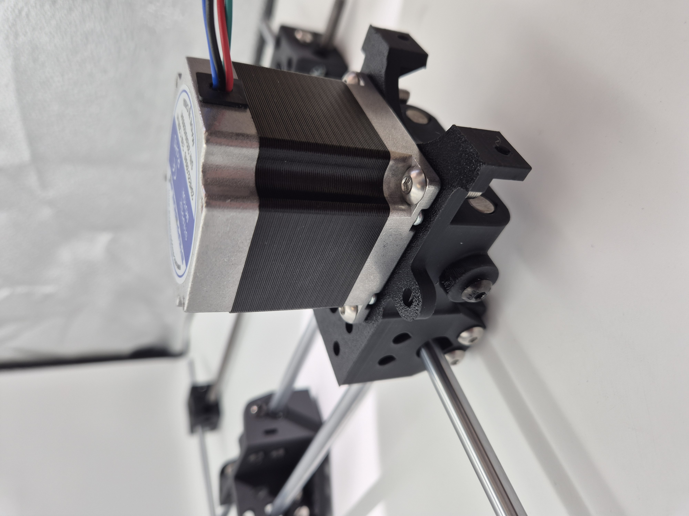

Ces éléments assurent le mouvement du chariot X de gauche à droite, permettant à la tête d’extrusion de parcourir l'axe horizontal.

---

## Assemblage du cadre supérieur

On installe désormais le cadre supérieur sur la machine.

  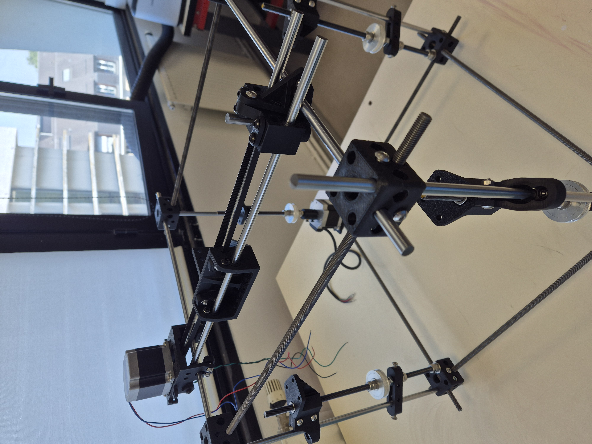

---

## Installation des supports de palier et du moteur y

Sur trois coins (ceux sans moteur), on installe la pièce y-bearing-housing, qui permet de guider les tiges horizontales du plateau. Ces pièces se fixent à la verticale comme sur l'image ci-dessous, il faudra 6 tiges lisses de 6cm pour fixer cette pièce sur les corner brackets.

  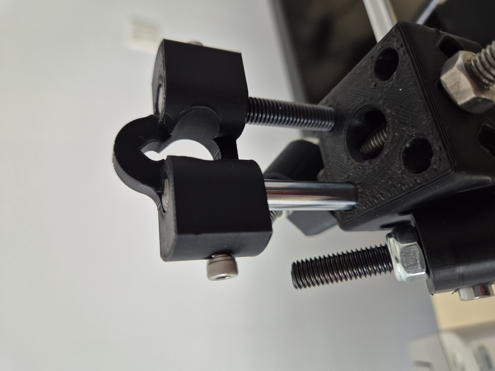

Le quatrième coin accueillera la fixation moteur Y, qui est légèrement différente et sera détaillée dans l'étape suivante.

  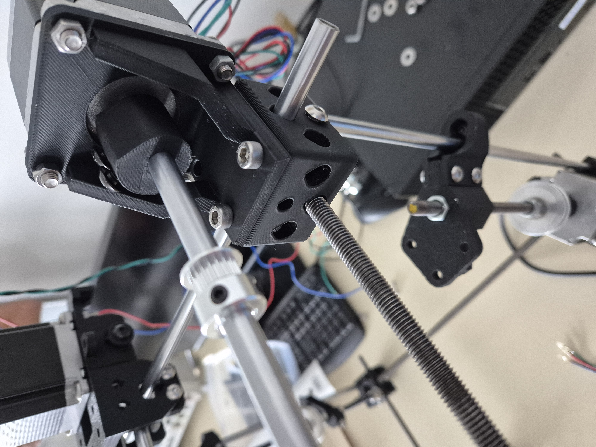

---

## Installation du plateau d'impression

Une fois la structure principale terminée, on installe le plateau de 38,5 cm x 38,5 cm en bois, fidèle au modèle original de la Darwin.

Ce plateau repose sur la structure grâce à 4 bed-clamp qui maintiennent fermement le plateau sur les 	bed-constraint-bracket.

---

## Montage & découpage de la courroie du plateau Z

Le plateau d’impression repose sur quatre tiges filetées.  
Pour les synchroniser, on utilise une courroie unique qui passe sur les quatre poulies que le moteur Z entraîne.

**Pourquoi couper et refermer la courroie ?**
Trouver une courroie fermée assez longue pour ce périmètre est presque impossible.  
La solution : acheter une courroie plus grande, la découper puis la refermer soi-même, en conservant sa rigidité et sa souplesse.

## 3. Préparation de la jointure

| Étape | Action | 
|-------|--------|
| 1 | Couper les deux extrémités de la courroie en biais (≈ 45 °). |
| 2 | Aligner soigneusement les dents face à face pour reconstituer une courroie continue. |
| 3 | Épingler dent par dent avec des épingles de couture ≤ 0,5 mm de diamètre. |
| 4 | Renfort : coller au dos un troisième morceau de courroie avec de la colle néoprène. |

## 4. Mise en place & réglages

- Assurez-vous que les quatre poulies sont à la même hauteur avant d’installer la courroie.

## 5. Contrôle final
- Faites tourner manuellement le système : la courroie doit circuler sans sursaut au niveau de la jointure.  
- Si une dent accroche : recouper/poncer très légèrement ou reprendre l’alignement.

---

##Rendu final

  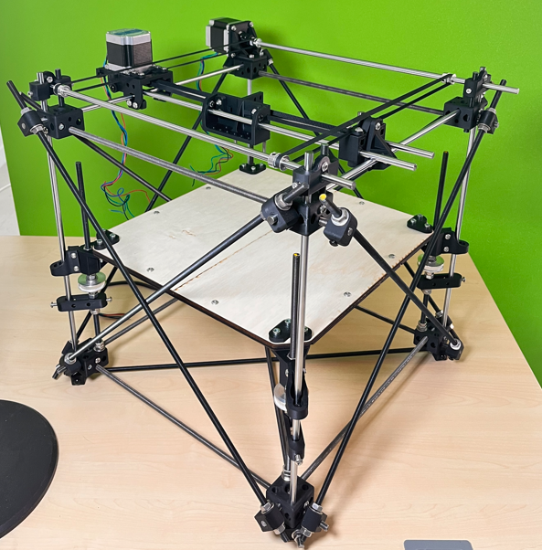

