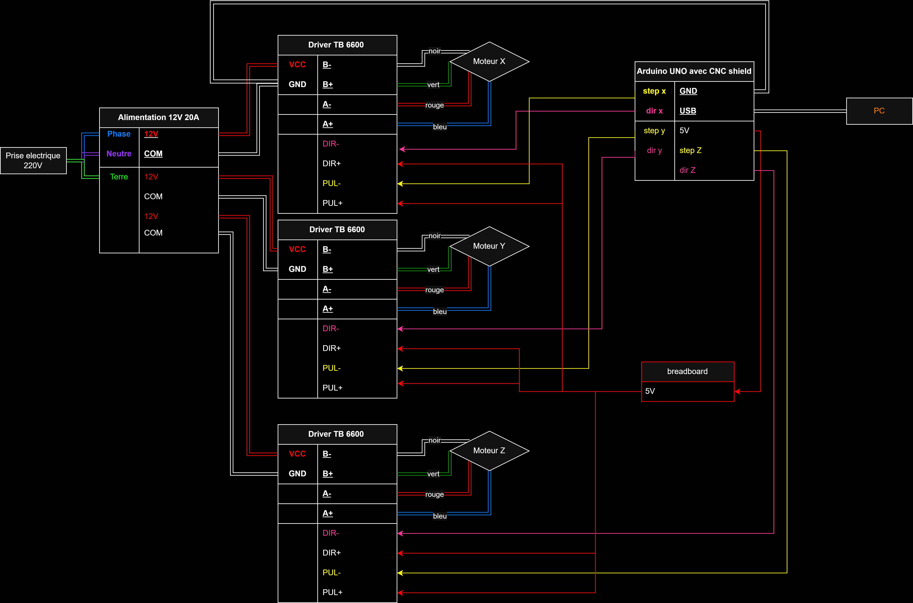
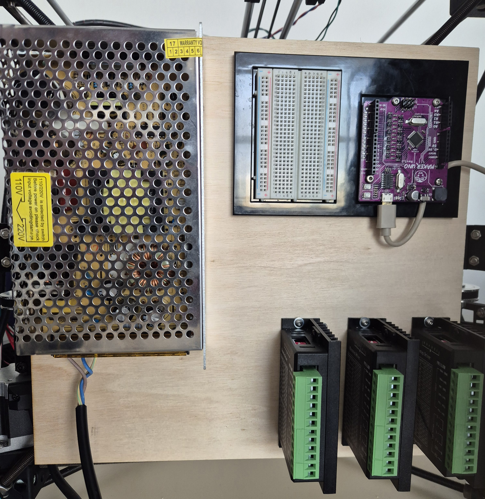

## Électronique de la Darwin

Pour faire fonctionner l'imprimante, nous avons besoin des composants électroniques suivants :

- 1 alimentation 12V 20A
- 1 carte Arduino (MakerUNO) avec CNC shield
- 3 drivers TB6600

### Schéma de câblage

Le schéma suivant illustre comment tous les composants doivent être connectés :

  

### Vue réelle du montage

Voici une photo du montage réel installé sur une planche en bois fixée à l'imprimante :

  

Sur cette image, on distingue :

- À gauche : l'alimentation 12V
- En haut à droite : la carte Arduino MakerUNO
- En bas à droite : les 3 drivers TB6600 (pour les axes X, Y, Z)

> ⚠️ Assurez-vous de bien respecter le sens des câblages DIR+, DIR-, PUL+, PUL- ainsi que les connexions moteurs sans quoi les moteurs pas à pas ne fonctionneront pas correctement.

---

## Test du fonctionnement

Une fois le câblage terminé, vous pouvez tester les axes en utilisant UGS (Universal Gcode Sender) avec le firmware GRBL installé sur l’Arduino.

- Vérifiez que l’Arduino est bien reconnu via le port COM.
- Lancez UGS et envoyez des commandes de déplacement simples pour vérifier le mouvement des moteurs.
