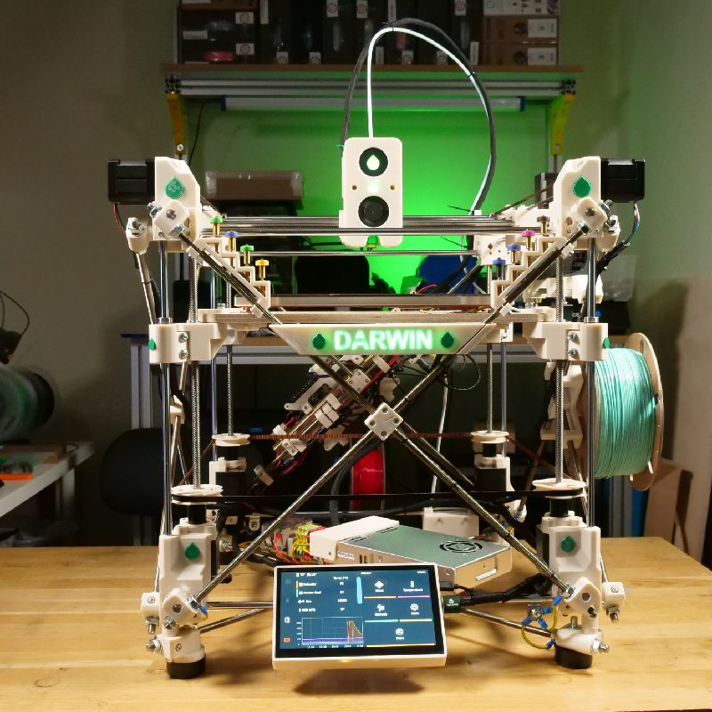

# Analyse de la Darwin

Pour commencer, nous avons fait une analyse technique de la Darwin d'origine. Cette première étape a permis de mieux comprendre les choix techniques effectués à l’époque de sa conception et d’identifier les points clés nécessitant des améliorations ou des adaptations aux standards actuels.

## Structure mécanique

La Darwin repose sur une structure en tiges métalliques et en pièces imprimées. Elle est novatrice pour l'époque mais présente certaines limites :

Rigidité : Les tiges filetées donnent une certaine stabilité mais sont susceptibles aux vibrations, surtout à haute vitesse.

Assemblage complexe : Le montage demande de nombreux ajustements manuels pour aligner correctement les axes.

## Système électronique

L’électronique d’origine de la Darwin est basée sur des composants aujourd'hui dépassées, comme certaines cartes Arduino et RAMPS.

Compatibilité limitée : Ces anciens composants offrent moins de fonctionnalités et sont plus difficiles à programmer.

Fiabilité : Certains circuits ne disposent pas de protection avancée contre les surchauffes ou les courts-circuits.

## Plateau d'impression

Les technologies de chauffage d’époque rendent la montée en température lente.

# Projet existant

     
  <em>Imprimante <strong>Darwin Evo</strong></em>

Avant de débuter la conception de notre propre imprimante, nous nous sommes appuyés sur des recherches autour de la Darwin Evo, une évolution moderne de la RepRap Darwin. Étudier ce modèle nous a permis de mieux comprendre les limitations de la version originale, les améliorations apportées au fil du temps, ainsi que les choix techniques pertinents à reproduire ou adapter. Cette démarche nous a servi de base de réflexion pour concevoir une version fidèle à l’esprit du projet tout en étant compatible avec les composants disponibles aujourd’hui.
