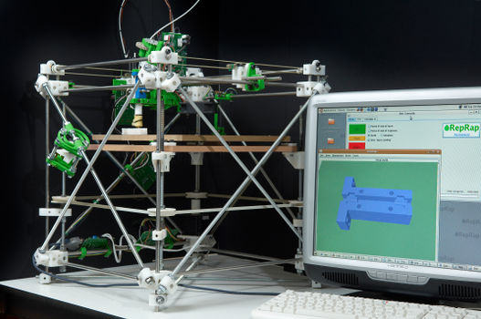

# Bienvenue sur notre documentation

Bienvenue dans la documentation du projet qui consiste à reconstruire la Darwin, la première imprimante 3D open-source de la famille RepRap. Ce site a pour but de fournir toutes les informations nécessaires pour comprendre, utiliser et reproduire efficacement notre projet.

Image test temporaire :

## À propos du Projet

L'objectif de notre projet est de reproduire la toute première imprimante 3D open-source. C'est à la fois un défi technique mais aussi historique. Ainsi, nous   avions comme contraintes de garder l'esprit open-source et les principes de conception de la Darwin tout en intégrant des technologies actuelles. 

## Poster

Ici vous publierez le poster de votre projet.

## Vidéo

Ici vous publierez la vidéo de votre projet. 
- Moins de 1min30
- Présentation du projet 
- Des explication du fonctionnement du projet
- Des vues du projet / Prototype / Application etc... 
- Des plans du fonctionnement (même basique ou des éléments séparés)
- Une conclusion
- Si en stockage local : <50mo

<video src="images/intro_amiens.mp4" controls title="Title"  style="width: 100%;"></video>

---
