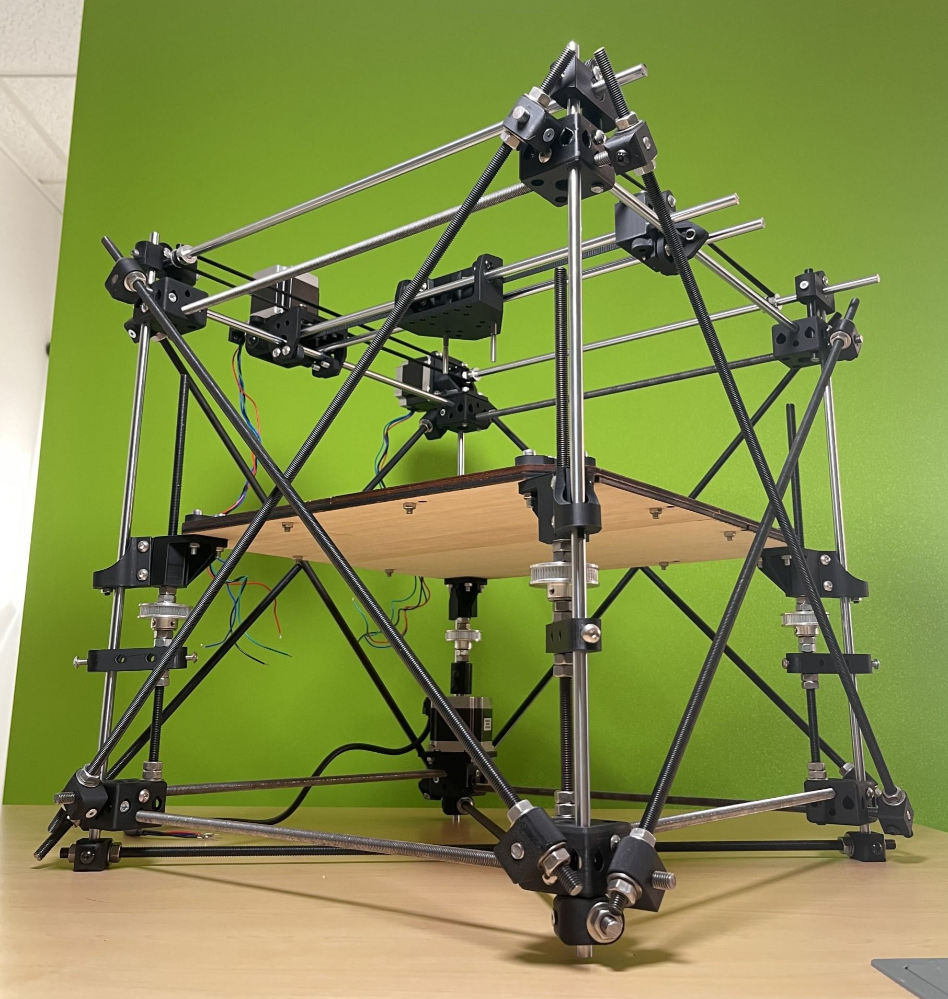
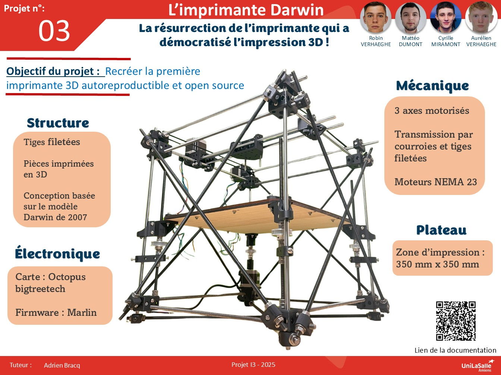

# Bienvenue sur notre documentation

Bienvenue dans la documentation du projet qui consiste à reconstruire la première imprimante 3D open-source de la famille RepRap.  
Ce site a pour but de fournir toutes les informations nécessaires pour comprendre, utiliser et reproduire efficacement notre projet.  
Nous sommes fiers qu’en partageant chaque étape de notre démarche (historique, conception, essais, difficultés et solutions), nous avons participons à l’esprit de l'open source d'origine du projet.

  

## À propos du Projet

Notre objectif est de reproduire la Darwin, première imprimante 3D open-source de 2007, qui a posé les bases du projet RepRap. En relevant ce défi historique, nous cherchons à conserver l’esprit autoreproductible et collaboratif tout en modernisant la mécanique et l’électronique pour la rendre compatible avec les standards actuels.

En partageant chaque étape (CAO, assemblage, tests et calibrages), nous contribuons à la diffusion des connaissances en impression 3D, à l’image de la philosophie open-source qui a toujours animé la communauté RepRap.  

## Poster

## Vidéo

Vous pouvez retrouver la vidéo de présentation de notre projet en cliquant ici :

[Voir la vidéo](https://youtube.com/shorts/6nFDiHbBPig?si=J24U8QqtGgtm-Lb4)

---

## Remerciements

Nous tenons à remercier l’école d'UniLaSalle Amiens qui nous a offert l’opportunité de réaliser ce projet de reproduction de l’imprimante Darwin dans le cadre de notre formation. Ce travail nous a permis de mettre en pratique les connaissances acquises au cours de notre cursus, tout en développant des compétences techniques, organisationnelles et collaboratives essentielles à notre future carrière.

Nous adressons nos remerciements les plus sincères à Adrien Bracq, notre encadrant, pour son accompagnement rigoureux, sa disponibilité constante et la qualité de ses conseils tout au long de ce projet. Son expertise nous a été précieuse à chaque étape, tant dans la compréhension du projet que dans la résolution des difficultés rencontrées.

Nous souhaitons également exprimer notre profonde gratitude à Rémi Lacombe, dont la patience, l’écoute et la bienveillance nous ont été d’un grand soutien. Il a su répondre à nos nombreuses interrogations, même les plus simples, avec pédagogie et encouragement, ce qui a grandement contribué à notre progression.

Enfin, nous remercions l’ensemble du personnel pédagogique et technique de l’école pour leur implication, ainsi que tous nos camarades pour les échanges constructifs et l’entraide qui ont enrichi cette expérience.
